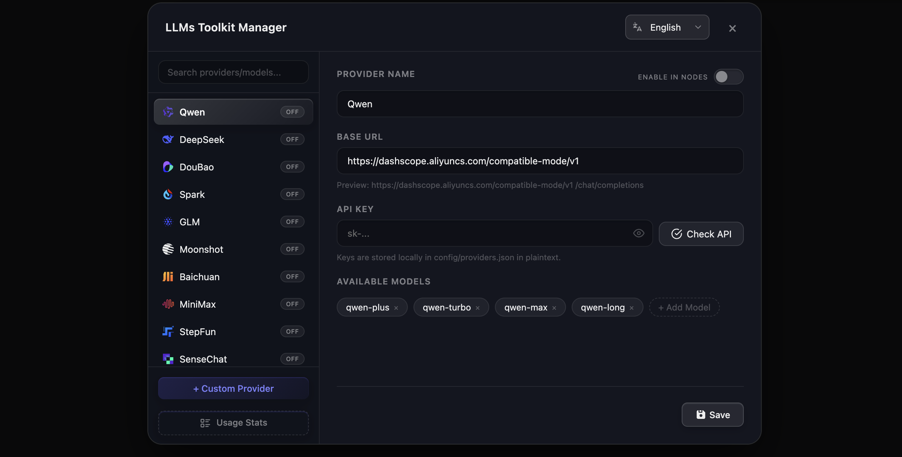

<div align="center">

# ComfyUI-LLMs-Toolkit



**Language**

[](README.md)
[](README_CN.md)

---

[](https://github.com/HuangYuChuh/ComfyUI-LLMs-Toolkit/stargazers)
[](https://github.com/HuangYuChuh/ComfyUI-LLMs-Toolkit/network)
[](https://github.com/HuangYuChuh/ComfyUI-LLMs-Toolkit/issues)
[](LICENSE)
[](https://github.com/HuangYuChuh/ComfyUI-LLMs-Toolkit/commits)

**Bring the power of Large Language Models into your ComfyUI workflows — no GPU needed.**

</div>

---

## What is this?

ComfyUI-LLMs-Toolkit lets you call mainstream LLMs (like DeepSeek, Qwen, GPT, Moonshot, and many more) directly from your ComfyUI workflows using simple API connections. 

Whether you want to generate text, translate content, process images with vision models, or build structured JSON — this toolkit has you covered.

### Key Features

- **Built-in Provider Manager** — Manage all your API providers visually from ComfyUI's menu bar. No config files to edit.
- **12 Providers Pre-configured** — Qwen, DeepSeek, GLM, Doubao, Spark, Moonshot, Baichuan, MiniMax, StepFun, SenseChat, iFlow, ModelScope.
- **Smart Model Dropdown** — Select a provider, and the model list updates automatically.
- **Vision Support** — Send images to multimodal LLMs with the Image Preprocessor node.
- **Won't Crash Your Workflow** — If an API call fails, you get a readable error message instead of a broken workflow.
- **Multi-turn Memory** — Enable conversation memory for chat-style interactions.

---

## Installation

### Option A: ComfyUI Manager (Recommended)

1. Open **ComfyUI Manager**
2. Search for `ComfyUI-LLMs-Toolkit`
3. Click **Install** → **Restart ComfyUI**

### Option B: Manual Install

```bash
cd ComfyUI/custom_nodes/
git clone https://github.com/HuangYuChuh/ComfyUI-LLMs-Toolkit.git
cd ComfyUI-LLMs-Toolkit
pip install -r requirements.txt
```

Then restart ComfyUI.

---

## Getting Started

### Step 1: Open the Provider Manager

After installation, you'll see a **`LLMs_Manager`** button in ComfyUI's top menu bar. Click it to open the settings panel.

### Step 2: Set Up Your Provider

1. **Pick a provider** from the left sidebar (e.g., DeepSeek)
2. Enter your **API Key** (get one from the provider's website)
3. Click **Check API** to make sure it works ✅
4. Add or edit the **models** you want to use
5. Click **Save** and toggle **Enable in Nodes** on

### Step 3: Add Nodes to Your Workflow

1. Right-click in ComfyUI → `Add Node` → `🚦ComfyUI_LLMs_Toolkit`
2. Add an **OpenAI Compatible Adapter** node
3. Select your provider and model from the dropdowns
4. Type your prompt, connect the output, and hit **Queue**!

### Where to Get API Keys

| Provider | Website | Free Credits |
|----------|---------|-------------|
| **DeepSeek** | [platform.deepseek.com](https://platform.deepseek.com/) | ¥500 free |
| **Qwen** | [dashscope.aliyun.com](https://dashscope.aliyun.com/) | 1M tokens/month |
| **GLM** | [open.bigmodel.cn](https://open.bigmodel.cn/) | 5M tokens/month |
| **Moonshot** | [platform.moonshot.cn](https://platform.moonshot.cn/) | Free trial |
| **OpenAI** | [platform.openai.com](https://platform.openai.com/) | $5 trial |

---

## Available Nodes

### LLM Nodes

| Node | What it does |
|------|-------------|
| **OpenAI Compatible Adapter** | The main node — send prompts to any OpenAI-compatible LLM and get text responses. Supports system prompts, multi-turn memory, and vision input. |
| **LLMs Loader** | Helper node for advanced config (outputs provider settings as a connection). |
| **LLM Translator** | Quick one-shot translation using any configured LLM. |

### Vision

| Node | What it does |
|------|-------------|
| **Image Preprocessor** | Converts ComfyUI images to a format that vision LLMs can understand. Connect it to the adapter node's `prep_img` input. |

### JSON Tools

| Node | What it does |
|------|-------------|
| **JSON Builder** (Simple / Medium / Large) | Create structured JSON data with 1, 5, or 10 key-value pairs. |
| **JSON Combine** | Merge multiple JSON objects into one. |
| **JSON Extractor** | Pull specific values out of a JSON string. |
| **JSON Fixer** | Automatically repair broken JSON that LLMs sometimes output. |

### Text Tools

| Node | What it does |
|------|-------------|
| **String Template** | Fill in template strings with variables, e.g., `"Hello {name}!"` → `"Hello Alice!"` |

---

## FAQ

<details>
<summary><strong>My workflow keeps saying "API Key is missing"</strong></summary>

Make sure you've:
1. Opened the **LLMs_Manager** panel
2. Selected your provider and entered the API key
3. Clicked **Save**
4. Toggled **Enable in Nodes** to ON

</details>

<details>
<summary><strong>Can I use local models like Ollama?</strong></summary>

Yes! Add a **Custom Provider** in the LLMs_Manager, set the Base URL to your local endpoint (e.g., `http://localhost:11434/v1`), and add your model names. Any OpenAI-compatible API works.

</details>

<details>
<summary><strong>The model dropdown shows wrong models</strong></summary>

Make sure to **refresh the browser** (Cmd+R / Ctrl+R) after making changes in the Provider Manager. The model list updates dynamically based on the selected provider.

</details>

<details>
<summary><strong>Where is the troubleshooting guide?</strong></summary>

See [`docs/troubleshooting.md`](docs/troubleshooting.md) for dependency conflicts, provider/model mismatch, and local endpoint debugging.

</details>

---

## A Note on Security

Your API keys are stored **locally** on your machine in `config/providers.json`. This file is excluded from Git by default, so your keys won't be accidentally shared if you push your code. Just be careful not to share this file manually.

---

## Changelog

### v1.2.1 — 2026-03-07
- Sync package version metadata to match current release line
- Add `docs/troubleshooting.md` for common dependency/provider setup issues

### v1.2.0 — 2026-03-02
- Built-in **Provider Manager UI** with Cherry-Studio-style design
- Dynamic model filtering by provider
- Custom modal dialogs replacing native browser prompts
- Simplified node interface (removed redundant custom inputs)

### v1.1.0 — 2026-03-01
- DeepSeek reasoning content extraction
- o1/o3 model system role compatibility
- Shared API client with smart retry
- Graceful error handling (no more workflow crashes)
- Fixed multi-turn memory and token display bugs

---

## License

[GNU Affero General Public License v3.0 (AGPL-3.0)](LICENSE) — Free to use, modify, and share. If you modify or include this code in a service over a network, you must make the complete source code of your changes open and available under the same license.

---

<div align="center">

### If this project helps you, please give it a Star!

[](https://star-history.com/#HuangYuChuh/ComfyUI-LLMs-Toolkit&Date)

[](https://github.com/HuangYuChuh)

**Made with ❤️ for the ComfyUI community**

</div>
